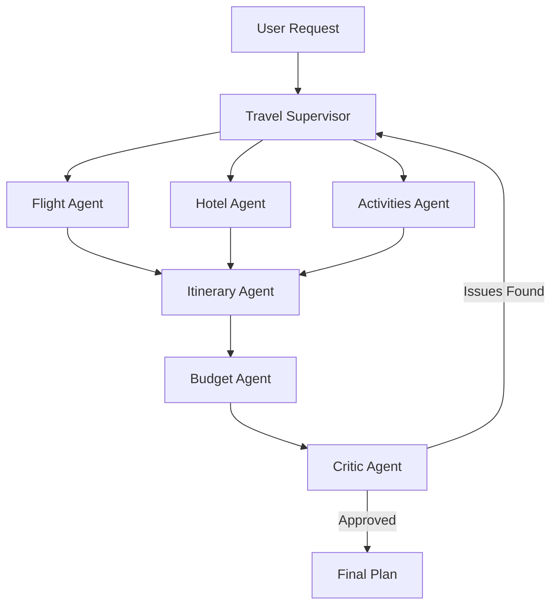

# TravelOps AI
A production-quality multi-agent travel planning system built with LangGraph, LangChain, and Gemma 4.

## Architecture
- **Multi-Agent System**: Uses a Supervisor agent to orchestrate specialists.
- **Specialists**: Flight, Hotel, and Activities agents for data retrieval.
- **Synthesis**: Itinerary and Budget agents to build and validate the plan.
- **Quality Control**: An independent Critic agent triggers rework loops.
- **LLM**: Powered by Gemma 4 via Ollama (Cloud or Local).

## Key Features
- Parallel execution of specialist agents.
- Structured communication via Pydantic models.
- Deterministic Mock Mode for testing without API keys.
- FastAPI and CLI interfaces.
- End-to-end evaluation suite for consistency.

## Installation
```bash
git clone https://github.com/your-repo/travelops-ai.git
cd travelops-ai
python3 -m venv .venv
source .venv/bin/activate
pip install -r requirements.txt
```

## Configuration
Create a `.env` file based on `.env.example`:
```env
LLM_PROVIDER=ollama # or 'mock'
OLLAMA_MODEL=gemma4:31b-cloud
OLLAMA_BASE_URL=https://api.ollama.com
OLLAMA_API_KEY=your_api_key_here
```

## Usage

### CLI
Plan a trip using the CLI:
```bash
python -m travelops.cli plan "Plan a 7-day trip from SF to Japan for two people with a $6,000 budget. We like food and hiking."
```
Run in **Mock Mode** (no API key needed):
```bash
python -m travelops.cli plan "Plan a 5-day trip to Paris" --mock
```

### API
Start the FastAPI server:
```bash
python -m travelops.api.main
```
Send a request:
```bash
curl -X POST http://localhost:8000/plan \
-H "Content-Type: application/json" \
-d '{"request": "Plan a 3-day trip to New York for a family"}'
```

## Testing & Evaluation
Run the unit tests:
```bash
pytest
```
Run the end-to-end evaluation cases:
```bash
pytest tests/test_eval.py
```

## Architecture Diagram

